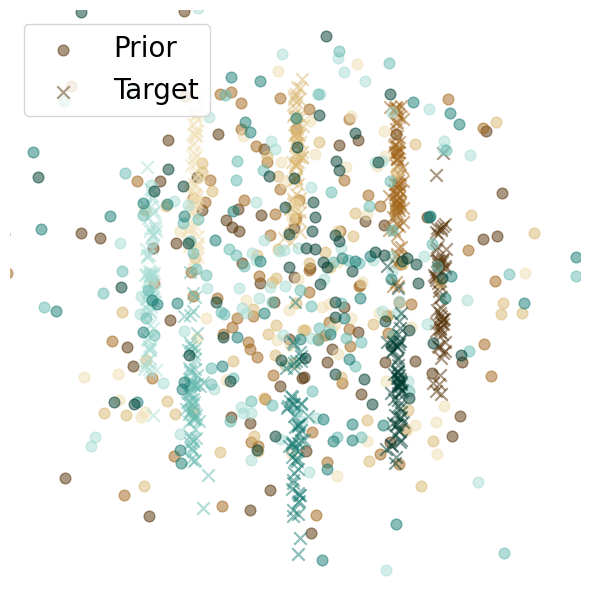
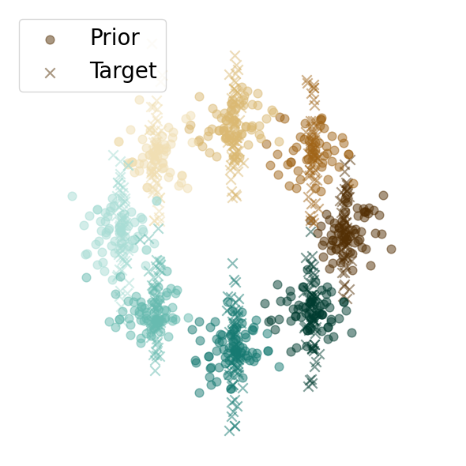

# Designing a Conditional Prior Distribution for Flow-Based Generative Models

[](https://openreview.net/group?id=TMLR)
[](https://arxiv.org/abs/2502.09611)
[](https://opensource.org/licenses/MIT)

**Authors:** [Noam Issachar](https://noamiss.github.io/)*, [Mohammad Salama](https://github.com/MoSalama98)*, Raanan Fattal, Sagie Benaim  
*Equal contribution  
The Hebrew University of Jerusalem

## Abstract

Flow-based generative models have recently shown impressive performance for conditional generation tasks, such as text-to-image generation. However, current methods transform a general unimodal noise distribution to a specific mode of the target data distribution. As such, every point in the initial source distribution can be mapped to every point in the target distribution, resulting in long average paths. To this end, in this work, we tap into a non-utilized property of conditional flow-based models: the ability to design a non-trivial prior distribution. Given an input condition, such as a text prompt, we first map it to a point lying in data space, representing an "average" data point with the minimal average distance to all data points of the same conditional mode (e.g., class). We then utilize the flow matching formulation to map samples from a parametric distribution centered around this point to the conditional target distribution. Experimentally, our method significantly improves training times and generation efficiency (FID, KID and CLIP alignment scores) compared to baselines, producing high quality samples using fewer sampling steps.

## Illustration of our approach

<p align="center">
  
  
</p>

<p align="center">
  <strong>Left:</strong> Flow Matching (Baseline) | <strong>Right:</strong> Ours (Proposed Method)
</p>

The figure illustrates the key difference between standard flow matching and our approach. In the baseline (left), prior samples are broadly distributed and can map to any target point within a class, resulting in long transport paths. Our method (right) creates class-specific prior distributions where source points are naturally closer to their corresponding target points, enabling more efficient training and sampling.

## Key Idea

Current conditional flow-based models inject conditioning information through cross-attention mechanisms but still initialize from a generic noise distribution. This means:
- Every source point can map to every target point across all conditional modes
- Long average transport distances lead to inefficient training and sampling
- Many integration steps required for high-quality generation

**Our solution:** Leverage the conditioning variable to construct an informative prior distribution where:
- Each condition has its own source distribution centered near its target mode
- Source points are naturally closer to their corresponding target points
- Shorter paths enable faster convergence and fewer sampling steps

---

## Method

### Core Contributions

1. **Conditional Prior Distribution (CPD):** A parametric Gaussian Mixture Model where each component corresponds to a conditional mode, with statistics derived from the target distribution.

2. **Discrete Conditioning (Class-conditional):** Direct estimation of class-specific Gaussian statistics from training data.

3. **Continuous Conditioning (Text-to-image):** A lightweight **Mapper Network** that projects text embeddings (CLIP) to learned mean points in latent space, combined with fixed covariance.

4. **Theoretical Justification:** Lower transport cost directly reduces global truncation error in ODE integration, enabling efficient sampling with fewer steps.

### Architecture

- Flow matching operates in the latent space of a pre-trained VQ-VAE
- For text conditioning: CLIP embeddings → Mapper Network → Gaussian mean in latent space
- Standard UNet architecture for velocity field estimation
- Conditioning via cross-attention mechanisms


## Results

### Quantitative Performance

Our method achieves **state-of-the-art efficiency** at low sampling budgets:

#### ImageNet-64 (Class-conditional, 15 NFEs)

| Method | FID ↓ | KID ↓ | CLIP Score ↑ |
|--------|-------|-------|--------------|
| **Ours** | **13.62** | **0.83** | **18.05** |
| CondOT | 16.16 | 1.96 | 18.02 |
| BatchOT | 16.10 | 1.43 | 17.72 |
| DDPM | 47.51 | 6.74 | 17.71 |

#### MS-COCO (Text-to-image, 15 NFEs)

| Method | FID ↓ | Transport Cost |
|--------|-------|----------------|
| **Ours** | **18.05** | **510** |
| CondOT | 28.32 | 630 |
| BatchOT | 26.45 | 604 |

**Key findings:**
- **Convergence at 15 NFEs** vs. 30+ NFEs for baselines
- **10-20% lower transport cost** on both datasets
- **Faster training convergence** with lower per-epoch NFE requirements
- **Superior CLIP alignment** for text-conditional generation

## Installation

### Requirements

- Python 3.8+
- CUDA-capable GPU (recommended)
- PyTorch 1.12+

### Setup

1. Clone this repository:
```bash
git clone https://github.com/yourusername/flowmatching_TMLR.git
cd flowmatching_TMLR
```

2. Install dependencies:
```bash
pip install -r requirements.txt
```

3. Download pre-trained models:
   - VQ-VAE model weights should be placed in `models_weights/vq_model_weights/`
   - Pre-trained projector weights (if available) should be placed in `models_weights/projector_noise/`

## Usage

### Training the Projector/Decoder

Train the projector model that maps CLIP text embeddings to VQ-VAE latent space:

```bash
python train_mapper.py \
    --vqae_directory models_weights/vq_model_weights \
    --clip_model_name openai/clip-vit-base-patch32 \
    --output_dir models_weights/projector_no_noise \
    --num_train_epochs 20 \
    --batch_size 256 \
    --learning_rate 1e-4 \
    --image_size 256
```

### Training the Flow Matching Model

Train the main flow matching model for text-to-image generation:

```bash
python train.py \
    --output_save_dir models_weights \
    --output_dir models_weights/fm_noise_weights \
    --num_steps 10 \
    --dim_z 32 \
    --sigma 0.7 \
    --num_train_epochs 50 \
    --batch_size 32 \
    --learning_rate 1e-5 \
    --weights_projector_path models_weights/projector_noise/decoder_weights.pth \
    --load_z models_weights/projector_noise/z_final.pth
```

### Key Arguments

**For `train_mapper.py`:**
- `--vqae_directory`: Directory containing VQ-VAE model weights
- `--clip_model_name`: CLIP model identifier (default: `openai/clip-vit-base-patch32`)
- `--output_dir`: Output directory for saved model weights
- `--num_train_epochs`: Number of training epochs
- `--batch_size`: Training batch size
- `--learning_rate`: Learning rate for optimizer
- `--image_size`: Image size (default: 256)

**For `train.py`:**
- `--output_save_dir`: Base directory for model weights
- `--output_dir`: Output directory for flow matching model weights
- `--num_steps`: Number of flow matching steps
- `--dim_z`: Dimension of Gaussian noise vector z
- `--sigma`: Sigma value for noise injection
- `--weights_projector_path`: Path to pre-trained projector weights
- `--load_z`: Path to z statistics file
- `--resume_from_checkpoint`: Epoch number to resume from (optional)

## Project Structure

```
flowmatching_TMLR/
├── train.py              # Main flow matching training script
├── train_mapper.py       # Projector/decoder training script
├── dataset.py            # Dataset loading utilities
├── neural_models.py      # Neural network model definitions
├── metrics.py            # Evaluation metrics
├── requirements.txt      # Python dependencies
└── README.md            # This file
```

## Citation

If you use this code in your research, please cite our paper:

```bibtex
@article{your_paper_2024,
  title={Flow Matching for Text-to-Image Generation},
  author={Your Name and Co-authors},
  journal={Transactions on Machine Learning Research},
  year={2024}
}
```

## License

This project is licensed under the MIT License - see the LICENSE file for details.

## Acknowledgments

- Hugging Face for the `diffusers` and `transformers` libraries
- OpenAI for CLIP
- The flow matching community for foundational work

## Contact

For questions or issues, please open an issue on GitHub or contact [your email].

